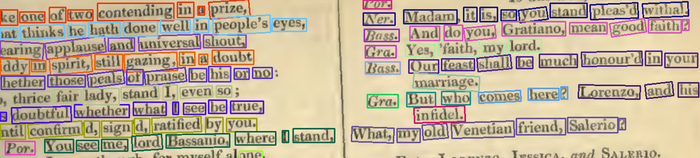

# 📝 CRAFT-Line-Extractor: Document line extractor with CRAFT

#### Video Demo: https://youtu.be/XXXXXX 
#### Description:
This application basic purpose is to analyze the CRAFT model output (individual detected words polygon regions) and logically derive the lines of text for each paragraph, it features three important components divided into 2 files:

1. **Text Detection (CRAFT Model)**: 
   - Located in `craft_text_detector.py`, this component is responsible for loading the pre-trained CRAFT model and performing text detection on the input images. It is basically an interface to use the CRAFT model with my own code.
   - **Key Functions**:
     - `load_craft_model()`: Initializes and loads the CRAFT model, ensuring it runs efficiently by only loading the model once. It supports both CPU and GPU inference, providing flexibility in deployment.
     - `detect_text_from_image()`: Performs inference using the CRAFT model to detect text regions in the image. It also processes the detected text polygons and scales the result to match the original image dimensions.
   - **Design Choice**: The CRAFT model is optimized to extract individual word regions with high accuracy. It is not my work I just create d this interfacing file to make use of its output on my code.

2. **Sentence Grouping and Web Interface**:
   - Located in `app.py`, this component processes the CRAFT model output to group the detected word polygons into logical sentences or lines.
   - **Key Functions**:
     - `deskew_image()`: Preprocesses images by deskewing them, improving detection accuracy for documents that are not perfectly aligned.
     - `process_polys_to_lines()`: This function groups detected word polygons into coherent lines of text based on spatial proximity. It uses adjustable thresholds to control the grouping, making the system flexible for different types of documents (e.g., multi-column layouts).
     - `draw_bounding_boxes()`: Visualizes the detected and grouped sentences on the input image by drawing bounding boxes.
     - `process_image()` (API endpoint): This function serves as the entry point for the web interface. It accepts an uploaded image, processes it using the CRAFT model, and returns the grouped sentences either as coordinates or a visualization.
   
---

### Design Choices and Rationale:

#### Web Interface vs Command Line Interface:
- **Web Interface**: The decision to implement this project as a web interface rather than a simple command-line tool was driven by usability. A web-based API allows users to interact with the model remotely, which simplifies deployment and allows non-technical users to leverage the tool without requiring deep knowledge of command-line operations. And, having the web interface can help me to showcase this in my own portfolio.
- **Command Line Interface (CLI)**: While CLI-based tools are useful for advanced users, the web interface makes the application more accessible and can be integrated into larger systems or used as a standalone service with minimal setup. (There will be future work to modularize this such that it can be accessed from command line as well as web interface).

#### CPU Inference as Default:
- **CPU as Default**: The application defaults to CPU inference for simplicity and broader compatibility across different environments. Not all users have access to GPU resources, and CPU inference ensures that the tool can be deployed universally without additional configuration.
- **GPU Optional**: For users with a GPU, the application allows easy switching to GPU inference by setting the `use_cuda` flag to `True` in the code directly. If broader adoption is needed I can see moving this to GPU based approach as default and adding the requiered logic to easily switch between them in the API calls.

#### Dockerization:
- **Ease of Deployment**: The application is fully Dockerized, enabling users to deploy it on any system without worrying about library dependencies, Python environments, or system configurations. Docker ensures that the application runs consistently across different platforms, whether it’s a developer’s local machine or a cloud environment.
- **Isolated Environment**: Docker provides an isolated and reproducible environment, ensuring that updates to the system or its dependencies won’t affect the functionality of the application. This is especially important for production environments where stability is crucial.

---

[](https://github.com/hectorandac/CRAFT-Sentence-Extractor/actions/workflows/ci.yml)



## Purpose

This repository serves as a tool designed to extract sentences from documents by leveraging the **CRAFT (Character Region Awareness for Text Detection)** deep learning model. While CRAFT is a proven approach for word detection in OCR, it is actually doesn't provide line extraction and because of its nature it lacks overall document layout understanding. This provides an opportunity to expand its capabilities using modern Transformer models.

The goal of this project is to **enhance document analysis by creating a combined approach** that utilizes CRAFT for word-level detection and Transformers for understanding the document layout. However, this repository serve as the first part of that effort, in which its main purpose is to algorithmically help create a syntentic dataset that enable us to extract lines of texts instead of single words. This will ultimately lead to a more accurate and reliable sentence extraction pipeline.

---

## Motivation

The motivation behind this project is to address key challenges in the sentence extraction task using existing OCR technologies like CRAFT, which, while effective for word detection, it doesn't provide the understanding of document structure or sentence formation. This repository explores the **next phase of evolution in OCR tasks** by combining traditional models with Transformers for better contextual and layout comprehension.

This project was created as a submission for the **Harvard CS50 curriculum**, contributing towards the completion of the certificate.

---

## Strategy

The current approach follows a **two-stage pipeline**:

1. **Word Detection using CRAFT**: CRAFT detects character regions and extracts word bounding boxes.
2. **Sentence Grouping with Layout Awareness**: Words are then grouped into sentences based on document layout heuristics such as spatial relationships between words.

While effective, this approach has limitations:

- **Column Detection Sensitivity**: The grouping logic is sensitive to hyperparameters like column separation. Adjusting these parameters manually can affect detection accuracy, particularly for multi-column documents.
- **Mixed Orientation Text**: Our logic struggles with detecting text that mixes orientations. For example, documents with both horizontal and vertical text may yield incorrect results, as the algorithm expects uniform text orientation.
- **Transformer-Based Single-Pass Approach** *(Future Plan)*: To overcome these limitations, this repository lays the groundwork for a **single-pass Transformer-based approach**. The goal is to incorporate document layout understanding, such as sentence or paragraph grouping, by training a model that pairs with CRAFT.

---

## Roadmap and Future Plans

This project is part of a larger plan to develop a more **intelligent document understanding pipeline**. The next steps will involve:

- **Training a custom model** that jointly utilizes CRAFT for word detection and a **Transformer-based approach** for document layout understanding.
- Creating a **synthetic dataset** to facilitate training of the combined model.
- Moving towards a **single-pass extraction process** that natively understands the relationship between text regions, paragraphs, columns, and other document layout elements.

The ultimate goal is to develop a robust system that can **handle complex document layouts**, including multiple columns, mixed text orientations, and different fonts or styles.

---

## Contributions

Contributions are highly encouraged! If you are passionate about OCR, document layout understanding, or deep learning, feel free to:

- **Open an issue**: Report bugs, request features, or discuss ideas.
- **Submit a pull request**: Contribute by enhancing the sentence extraction logic or adding support for new document layouts.
- **Join the discussion**: Let’s build the future of document understanding together!

---

## Acknowledgments

This project is part of the **Harvard CS50 curriculum**, submitted as part of the final project for earning the certificate. The project is an exploration of deep learning models for document sentence extraction and layout analysis.

Stay tuned for updates as we embark on **training our custom model** and advancing document understanding through Transformers and CRAFT! 🔥

---

## License

This project is licensed under the MIT License - see the [LICENSE](LICENSE) file for details.

---

By blending modern Transformer-based methods with CRAFT’s word detection abilities, this repository aims to push the boundaries of document analysis and OCR tasks. Contributions are welcome to help us reach this vision faster! 🚀

---

### Sample Use

```bash
# Clone the repo
git clone https://github.com/hectorandac/CRAFT-Sentence-Extractor.git

# Install dependencies
pip install -r requirements.txt

# Run tests
pytest tests/

# Example usage (web service localhost:5000)
python app.py

# Making the request
curl --location 'http://localhost:5000/process_image' \
--form 'image=@"/home/hectorandac/Documents/DTrOCR/test.png"' \
--form 'options="{\"return_image\": true, \"return_coords\": true}"'
```

---

This repository is a stepping stone in understanding the intricacies of document layout and pushing towards a single-pass sentence extraction method—join the journey! 👨‍💻👩‍💻

--- 

**Future updates will include:**
- Synthetic dataset generation.
- Transformer integration with document layout comprehension.
- More robust handling of multi-column and mixed orientation documents.

